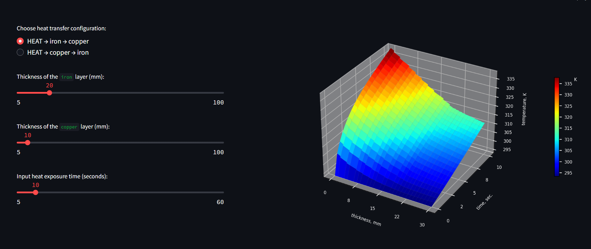

# nonsteady_heat_conductivity
## Abstract task of time-dependent heat conductivity in infinite sheet/plate made of iron and copper layers

Heat temperature and temperature at the free edge of the sheet/plate: 800 vs 30 (degree Celcius) respectively. Initial temperature of the metal is 20 degree Celcius. Sheet/plate is a bimetal compound made of 2 layers: iron and copper.
Uknown temperature (as a function of time and thickness) is obtained using finite difference method; system of linear equation is solved by using of direct and reverse pass. To start the analysis launch **exe.py**
> **Modules to be installed before usage:**
> * NumPy       >= 1.16.3
> * Matplotlib  >= 3.0.3
> * Scipy       >= 1.2.1

